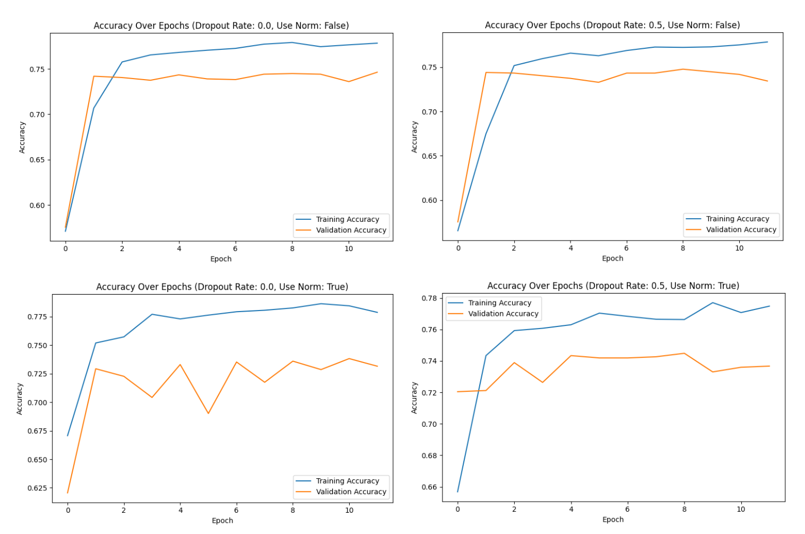

# Disaster Tweet Classification

This project aims to classify tweets into disaster-related and non-disaster-related categories using GloVe embeddings and GRU-based neural networks.

## Table of Contents

1. [Introduction](#introduction)
2. [Dataset](#dataset)
3. [Model Architecture](#model-architecture)
   1. [Comparison of GloVe, TF-IDF, and Word2Vec](#comparison-of-glove-tf-idf-and-word2vec)
   2. [Comparison of GRU, LSTM, and Bi-RNN](#comparison-of-gru-lstm-and-bi-rnn)
4. [Experiment Configurations](#experiment-configurations)
5. [Results and Analysis](#results-and-analysis)
6. [How to Use](#how-to-use)
7. [References](#references)

## Introduction

The goal of this project is to build a model that can accurately classify tweets as either related to disasters or not. This can help in quickly identifying and responding to disaster-related information on social media.

## Dataset

The dataset used for this project is the "Real or Not? NLP with Disaster Tweets" dataset from Kaggle. It contains tweets labeled as 1 if they are related to a disaster and 0 if they are not.

## Model Architecture

### Comparison of GloVe, TF-IDF, and Word2Vec

| Feature | GloVe | TF-IDF | Word2Vec |
|---------|-------|--------|----------|
| **Type** | Pre-trained word embeddings | Term frequency-inverse document frequency | Pre-trained word embeddings |
| **Model** | Global Vectors for Word Representation | Statistical measure | Continuous Bag of Words (CBOW) or Skip-gram |
| **Captures Context** | Yes, considers global word co-occurrence | No, treats each word independently | Yes, considers local word context |
| **Dimensionality** | Fixed (e.g., 200D, 300D) | Varies based on vocabulary size | Fixed (e.g., 200D, 300D) |
| **Training** | Pre-trained on large corpus (e.g., Common Crawl) | No training, computed directly from corpus | Pre-trained on large corpus (e.g., Google News) |
| **Performance** | Good balance between global and local context | Simple and efficient for document classification | Good for capturing semantic meanings |
| **Usage** | Suitable for downstream tasks like text classification | Simple models, quick computation | Suitable for tasks requiring word context |

**Why we use GloVe:**
GloVe embeddings provide a good balance between capturing global and local contexts of words, making them more generalizable and efficient compared to TF-IDF and Word2Vec.

### Comparison of GRU, LSTM, and Bi-RNN

| Feature | GRU | LSTM | Bi-RNN |
|---------|-----|------|-------|
| **Type** | Gated Recurrent Unit | Long Short-Term Memory | Bidirectional Recurrent Neural Network |
| **Complexity** | Less complex, fewer parameters | More complex, more parameters | Depends on underlying RNN (e.g., GRU or LSTM) |
| **Speed** | Faster training, less computation | Slower training due to more gates | Slower due to processing in both directions |
| **Memory** | Lower memory usage | Higher memory usage | Higher memory usage due to bidirectional processing |
| **Performance** | Good for capturing dependencies over short to medium sequences | Good for long-range dependencies | Better contextual understanding by processing input in both directions |
| **Usage** | Suitable for most sequence tasks with efficiency | Suitable for tasks with long-term dependencies | Suitable for tasks needing context from both past and future states |

**Why we use GRU:**
GRUs offer a good trade-off between complexity and performance, making them more efficient while still capable of capturing dependencies in sequences.

## Experiment Configurations

| Model | Dropout Rate | Use Normalization | Validation Accuracy |
|-------|--------------|-------------------|---------------------|
| A     | 0.0          | No                | 0.7463              |
| B     | 0.5          | No                | 0.7419              |
| C     | 0.0          | Yes               | 0.7382              |
| D     | 0.5          | Yes               | 0.7367              |

## Results and Analysis

Four models were trained with different configurations of dropout rates and normalization layers. Model A, with no dropout and no normalization, achieved the highest validation accuracy of 0.7463. Introducing dropout (Model B) and normalization (Model C) slightly reduced the validation accuracy. The combination of both techniques (Model D) resulted in the lowest accuracy. These results suggest that while regularization techniques like dropout and normalization can prevent overfitting, they might also slightly impact the model's ability to learn from the training data effectively.

## References

- [GloVe: Global Vectors for Word Representation](https://nlp.stanford.edu/projects/glove/)
- [GloVe GitHub Repository](https://github.com/stanfordnlp/GloVe)
- [Kaggle: NLP with Disaster Tweets](https://www.kaggle.com/c/nlp-getting-started/overview)
